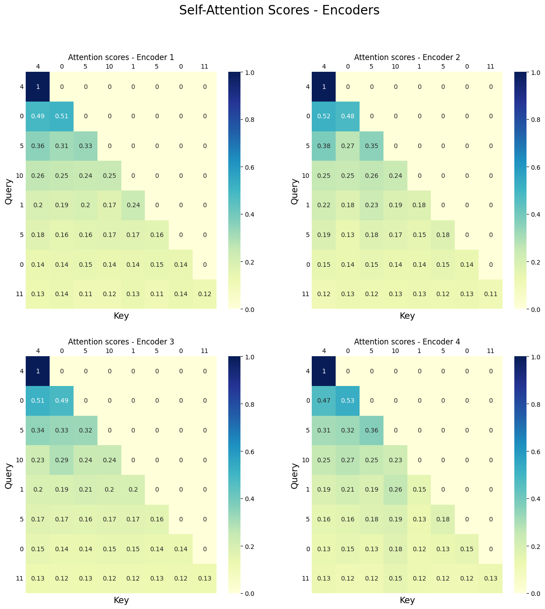
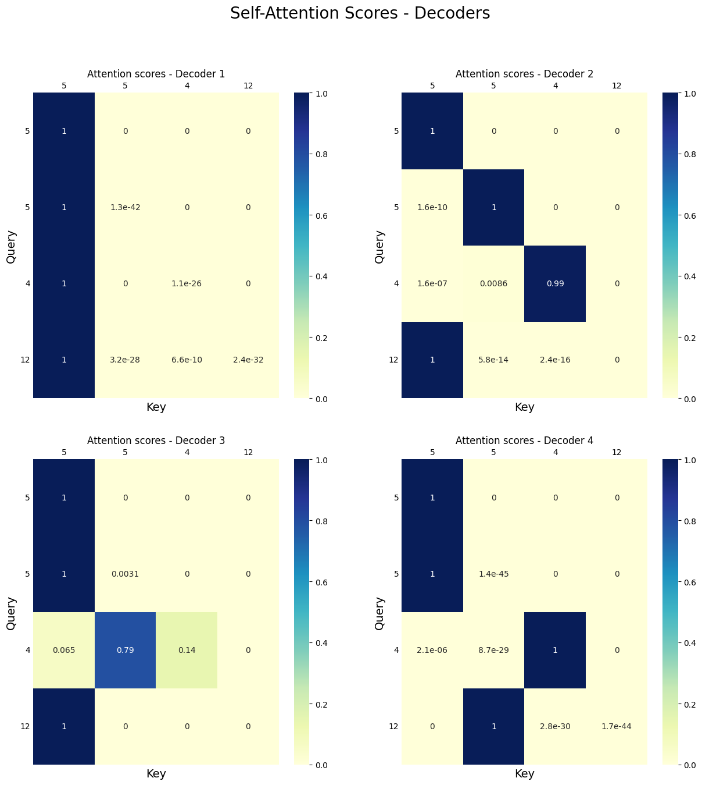
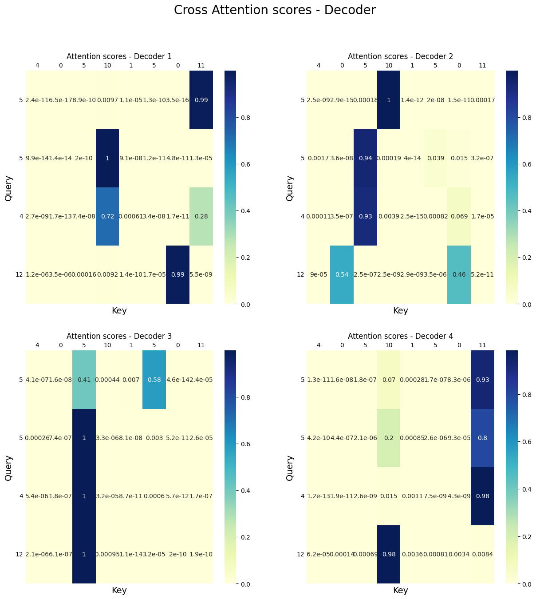

# Implementación del Transformer con PyTorch

## Introducción

Este proyecto presenta la implementación desde cero de un modelo **Transformer** en PyTorch. El Transformer, introducido en el artículo "Attention is All You Need", es una arquitectura clave en el procesamiento de lenguaje natural (NLP) y otras tareas relacionadas con secuencias, como la traducción automática y la generación de texto. En este proyecto, el modelo se aplica a dos problemas específicos:
1. **Predicción de secuencias de números consecutivos.**
2. **Resolución de sumas de números de tres dígitos.**

Adicionalmente, se incluye una evaluación detallada de los mecanismos de atención utilizados en el modelo, con pruebas específicas sobre matrices Q, K y V.

<br>

## Arquitectura

El Transformer implementado consta de los siguientes componentes principales:

### 1. **Self-Attention y Cross-Attention**
   - **Self-Attention**: Calcula las relaciones contextuales dentro de una misma secuencia. Utiliza matrices de consulta (Q), clave (K) y valor (V) para calcular puntuaciones de atención y representaciones ponderadas.
   - **Cross-Attention**: Extiende el mecanismo de atención para calcular relaciones entre dos secuencias diferentes (por ejemplo, entre la salida del encoder y el estado del decoder).

### 2. **Attention Head**
   - Implementa atención multi-cabeza, que permite que el modelo aprenda relaciones a diferentes niveles.

### 3. **Encoder**
   - Consiste en bloques de atención seguidos por normalización y redes completamente conectadas.
   - Aprende representaciones contextuales de las secuencias de entrada.

### 4. **Decoder**
   - Similar al encoder, pero incluye un componente de atención cruzada para relacionar las secuencias de entrada y salida.

### 5. **Modelo Transformer**
   - Combina múltiples encoders y decoders.
   - Genera las predicciones finales a partir de las representaciones aprendidas.

El modelo es altamente modular y permite ajustar parámetros como el número de cabezas de atención, dimensiones ocultas y profundidad del encoder/decoder.

<br>

## Prueba de la Atención

Para validar la implementación del mecanismo de atención, se realizaron pruebas específicas utilizando matrices predefinidas Q, K y V. Estas pruebas tienen como objetivo garantizar que la atención se calcula correctamente según la fórmula estándar:

$$
\text{Attention}(Q, K, V) = \text{Softmax}\left(\frac{QK^T}{\sqrt{d_k}}\right)V
$$

### **Clase Modificada de Self-Attention**
La clase `SelfAttention` se adaptó para aceptar matrices Q, K y V directamente, sin necesidad de una secuencia de entrada, permitiendo pruebas más precisas del cálculo.

### **Prueba con Matrices Predefinidas**
Se utilizaron las siguientes matrices:

- Q = [[0.0, 0.0, 0.0], [1, 1, 1], [0.2, 0.2, 0.2], [0.3, 0.3, 0.3]]
- K = [[0.1, 0.1, 0.1], [0.2, 0.2, 0.2], [0.3, 0.3, 0.3], [0.4, 0.4, 0.4]]
- V = [[1., 0., 0.], [0., 1., 0.], [0., 0., 1.], [0., 1., 1.]]

Los resultados obtenidos fueron los esperados, confirmando el correcto funcionamiento del mecanismo de atención. Estos resultados son:

$$
\text{Attention} = \begin{bmatrix}
1.0000 & 0.0000 & 0.0000 \\
0.4568 & 0.5432 & 0.0000 \\
0.3219 & 0.3332 & 0.3449 \\
0.2309 & 0.5130 & 0.5260
\end{bmatrix}
$$

<br>

## Suma de Números

### **Dataset**
Se generaron ejemplos de sumas con dos números aleatorios entre 100 y 499. Cada ejemplo se estructuró como una secuencia del tipo:
```
123+456=579e
```
donde `e` es un token especial que indica el final de la secuencia.

El vocabulario incluye los dígitos del 0 al 9, los caracteres `+`, `=`, y `e`. Las secuencias se convierten en representaciones one-hot y se procesan en batches uniformes mediante padding.

### **Entrenamiento**
El modelo se entrenó durante 10 épocas utilizando el optimizador Adam y la pérdida de entropía cruzada. Para cada batch:
1. Se alimentaron al modelo las primeras 8 posiciones de la secuencia (hasta el `=`).
2. El modelo predijo los dígitos correspondientes al resultado y el token final `e`.

### **Evaluación**
El modelo se evaluó utilizando datos no vistos durante el entrenamiento. Además, se analizaron las puntuaciones de atención generadas por los encoders y decoders, visualizándolas mediante mapas de calor.

<br>

## Resultados

### **Pruebas de Atención**
Las pruebas con matrices Q, K y V confirmaron que el mecanismo de atención se implementó correctamente. Los resultados coinciden con los cálculos esperados, demostrando la validez del modelo subyacente.

### **Suma de Números**
El modelo alcanzó una alta precisión en la tarea de suma, generalizando correctamente a secuencias no vistas. Algunos ejemplos evaluados incluyen:
- Entrada: `499+106=`
  - Predicción: `605e`
  - Resultado Correcto
- Entrada: `403+300=`
  - Predicción: `703e`
  - Resultado Correcto

### **Visualización de Puntuaciones de Atención**
Los mapas de calor generados para las puntuaciones de atención mostraron cómo el modelo identifica correctamente las relaciones entre los tokens de entrada y salida. Esto valida la efectividad de los componentes de atención del modelo.

En cuanto a los enconders, se obtuvieron las siguientes puntuaciones de atención en la primera de sus cabezas:



En cuanto a los decoders, se obtuvieron las siguientes puntuaciones de atención en la primera de sus cabezas:



En cuanto a la atención cruzada, se obtuvieron las siguientes puntuaciones de atención en la primera de sus cabezas en los decoders:



<br>

## Conclusión

La implementación del modelo Transformer desde cero en PyTorch ha demostrado ser exitosa, tanto en términos de su capacidad para aprender relaciones contextuales como en su rendimiento en tareas complejas como la resolución de sumas. Este proyecto proporciona una base sólida para explorar y entender los conceptos fundamentales de la arquitectura Transformer y sus aplicaciones.